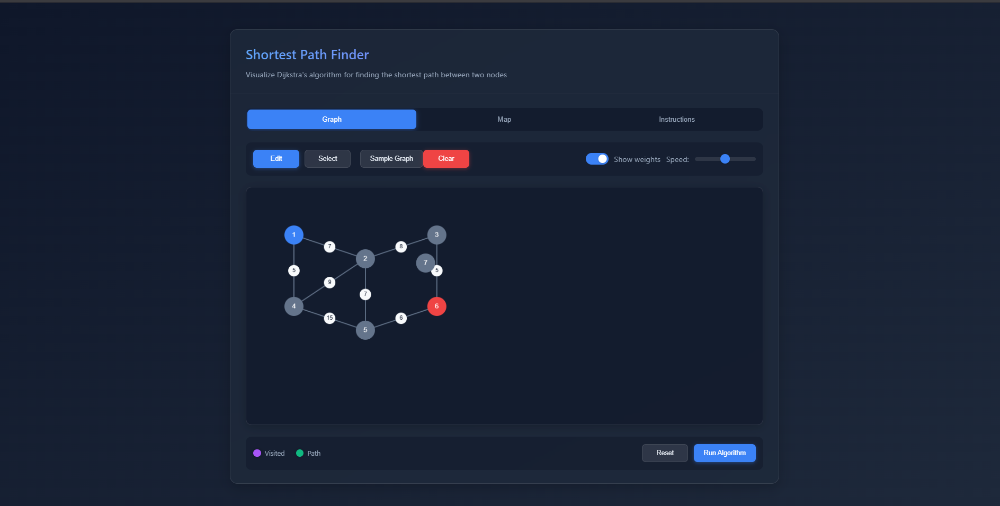
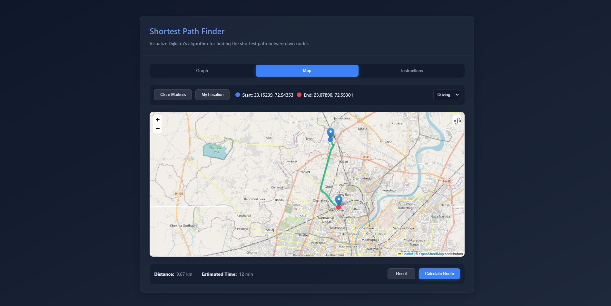

# Shortest Path Finder – Dijkstra Visualizer with Map 🌐

This project is an interactive web app for visualizing **Dijkstra's algorithm**. You can build and edit your own graphs, watch the algorithm in action, and even find real-world shortest routes on a map!  
Perfect for students, educators, or anyone curious about how shortest path algorithms work.

---

## 🚀 Features

- **Graph Visualizer:**  
  - Add, move, and connect nodes to build custom graphs.
  - Set edge weights and see them displayed.
  - Switch between Edit and Select modes.
  - Visualize Dijkstra’s algorithm step-by-step.
  - Adjustable animation speed.
  - Sample graph and clear/reset options.

- **Map Mode:**  
  - Place start and end points on a real-world map.
  - Choose transport mode: Driving, Walking, or Cycling.
  - Calculate and display the shortest route using Dijkstra’s algorithm.
  - See distance and estimated time.
  - Clear markers, reset, and locate your current position.

- **Instructions Tab:**  
  - Easy-to-follow usage guide.
  - Brief explanation of Dijkstra’s algorithm and visualization legend.

---

## 🖼️ UI Previews

### Graph Visualizer


### Map Mode


---

## 📦 How to Run

1. **Clone the repository:**
   ```sh
   git clone https://github.com/yourusername/your-repo.git
   cd your-repo
   ```

2. **Open `index.html` in your browser.**  
   No build step or server required!

---

## 🛠️ Tech Stack

- **HTML, CSS, JavaScript** (Vanilla)
- [Leaflet.js](https://leafletjs.com/) for interactive maps
- [Leaflet Routing Machine](https://www.liedman.net/leaflet-routing-machine/) for route calculation

---

## 📚 About Dijkstra's Algorithm

Dijkstra's algorithm finds the shortest path between nodes in a graph with non-negative edge weights. It's widely used in navigation and routing systems.

---

## ✨ Credits

- UI and logic by [Your Name]
- Map tiles & routing powered by [Leaflet](https://leafletjs.com/) and [Leaflet Routing Machine](https://www.liedman.net/leaflet-routing-machine/)

---

## 📄 License

This project is open source under the [MIT License](LICENSE).

---

**Enjoy exploring shortest paths! If you have suggestions or find bugs, feel free to open an issue or PR.**